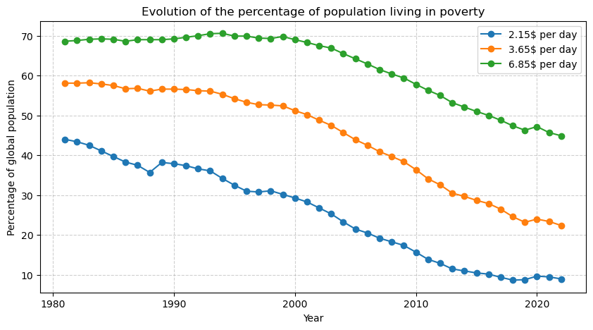
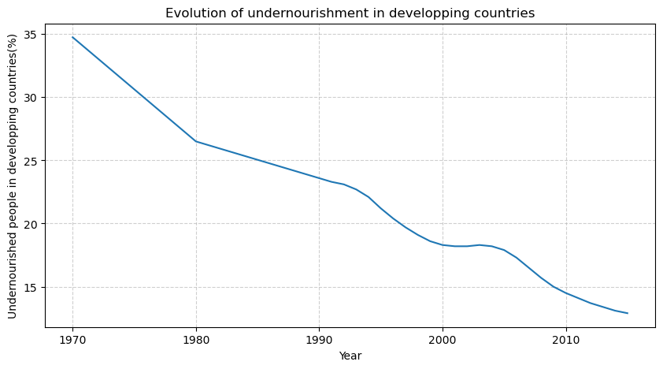
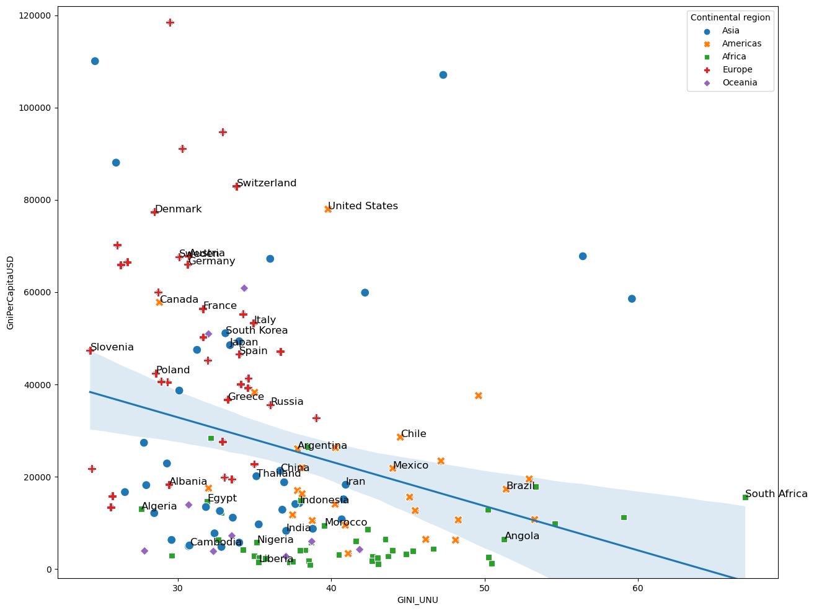

# Blind Spots: The Global Trends We Overlook

This project reveals global dynamics that we do not know, by the analysis of open data (World Bank, kaggle, wikipedia, The Heritage Foundation, Our World In Data). 

It is a common Idea that the World is not going well, that we are on the verge of a crisis or even a collapse, that overpopulation will submerge all the ressources, causing poverty and hunger all accross the world, worsen by inequalities caused by capitalism. 

Reading the brillant spirit Nassim Taleb, he brought my attention on a very important distinction that I want to illustrate with this data analysis: noise versus signal. Where is the signal ? Is the common discourse right on these subjects ? How awful is the World ? and how bad are its trends ? Let's find out.

Let's have a look on these 4 first subjects : hunger, poverty, ressources and overpopulation. Those might be the more obvious to treat. 

Let's first observe population. This one will put some following aspects in perspective.

It's growing. Fast. The fastest it ever grew. But ! And there's a big but, the rate of growing is also decreasing, significantly. In mathematics, we call that the derivative, it corresponds grossly to the slope of the tangent to the curve. To make an analogy with physics, it is like a velocity, and what we see is that the velocity is still high but less than it used to, wich means the acceleration is decreasing. We see fertility decreasing in many countries, it is even frightening in some. 

To measure poverty, there are 3 fixed thresholds at 2.15 $ per day, 3.65 and 6.35. The least being extreme poverty. Of course, we can reffine the analysis relatively to all country by studying the poorest quantil, but we want a big picture first, here. Let's see what the World Bank says about it.

Not only poverty decreases on every thresholds, but it decreases very fast ! The data I learned in high school are already outdated, and by a lot ! The extreme poverty was 50% 30 years ago and is now under 10%. While the population was growing.

Death by hunger also decreases a lot, during this time. In fact it seems populations manage to sustain better and better their food supply as they grow.

Isn't it puzzling ? More people to feed should lead to more poverty and scarcity, right ? That is, if we think linearly, like Malthus, who was envisioning overpopulation since the century, stating that food grow linearly while population grows exponentially. Well ... 200 years and 6 billions people later, we were never as prosperous and food was never as abundant. So what happened ? Malthus model was clearly wrong, as well as the models that predict that a growth of population leads to scarcity on food, ressources and rich.  

In what World desired goods becomes more abundant and cheap, more abundant than it used to when it was less needed ? 

To answer this question, let's dive into the second part : how awful is capitalism ? Causing inequalities, aggravating inequalities, making the rich richer and richer and the poor poorer and poorer. Little bonus on how capitalism will destroy the World in the end. 

What are the characteristics of capitalism ? And what makes it different from other economic regimes ? 

Freedom. Freedom of enterprise especially. 
Property. Being free to create a business and owning the results of the work put in the project. 
Laws protecting these principles equally for every actors of the market..

Let's see how we can analyze this with actual data. What could be a good proxy for measuring freedom ? Prosperity ? (In)equality ?

To measure prosperity, I think it's reasonable to consider the gni per capita. To measure freedom, the heritage institude proposed an index of freedom, being the combination of the freedom of speech, freedom of enterprise, fiscality, laws on private property, etc. To measure (in)equality, there is the famous gini index, that compares the distribution of wealth of a population with a perfectly equal situation, the closer to 0 gini index is, the less inequality, the closer to 100, the more inequality. 

Let's see now how these things relate to each other. First, let's observe the relationship between freedom and prosperity.

It's pretty clear on the graph that there is a strong relationship between prosperity and freedom. We can conclude that capitalistic free market countries seem to be more prosperous than others. It could be interesting to explore how this relate to equality, so let's see now the relationship between the prosperity and equality.

What this graph shows is this: poor countries can be egalitarian, rich countries too, but we tend to see much more rich countries with a low gini index (lower inequalities). Showing that, yes egalitarian countries can be poor, and rich countries are often egalitarian. 

The next graph came from the brilliant economist Didier Darcet, I reproduce one of his results here, showing the deep link between prosperity, equality and freedom. It seems, the more freedom, the more prosperity and the more equality, these three desirable things appear all together in some countries.

To go even further, we can see that these free, prosperous and equal countries are also the ones with the lowest incarceration rates.

We humans have a bias towards the negative, and medias can use that to captivate our attention, but this is often noise. The signal is in fact, less sensational, but more positive too. We hear the thunder falling on the tree, but not the forest slowly growing.

